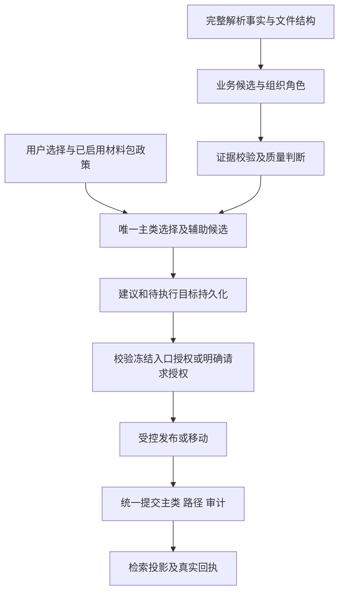

# 基于 workdata 实际文件的分类规则优化与主分类落位方案

日期：2026-09-10。状态：待实施设计；本次完成只读盘点、代码核查、代表性正文抽查和规则层回放，未修改业务代码、生产分类、数据库或用户文件。

修订：v2，按本轮用户明确要求，分类兜底统一为“其他”，不产生“待复核”“待分类”分类、流程或队列；明确更正主分类、明确移动直接执行，不二次确认。配套实施依据：[开发实施文档](2026-09-10-classification-optimization-development-spec.md)。

## 1. 结论与设计依据

建议沿用 9 月 8 日方案的“唯一主分类决定工作副本目录，多标签保留其他业务关联”，优先修复候选生成与证据判断，再上线分类和目录的统一提交。当前最需要处理的并非单纯增加关键词或提高阈值，而是：

1. `其他/发文` 兜底节点正在参与普通关键词竞争，会把正文里的“其他”误当成业务依据。
2. 简历规则在整篇长文中累计个人信息字段，再因任意位置出现招聘词提前返回单一招聘分类。
3. 学校/学院范围先行硬过滤，可能在判断具体业务之前排除正确类别。
4. 招聘、职称材料包规则覆盖正文候选，并把用途政策标成 `confidence=1.0`。
5. 通用文种、部门、业务对象、文件用途混在一套评分中；找到关键词的原文位置，不等于已经证明该分类正确。
6. 自动落位软门槛仍为测试停用状态，且缺少与真实样本匹配的校准。

实施顺序建议：**候选污染和简历误识别 → 业务与组织范围分离 → 业务边界及材料包规则 → 校准与主分类选择 → 主分类/目录联动 → 历史批次复评。**

### 1.1 本次核查基线

| 项目 | 核查结果 |
| --- | --- |
| 用户指定参考 | `C:\Users\zhouhexin\Downloads\2026-09-08-primary-category-directory-consistency-plan.md`，已阅读 |
| 本地 Git HEAD | `dffae7daf1b6745ce9f87c5a6b50f0d3b68fc00c`，2026-09-09，`feat: expose WorkBuddy file task tools` |
| 工作树 | 已存在 ingestion、retrieval、MCP 及测试的未提交改动；本次保留，分析基于读取时的工作树 |
| 分类配置 | `unified_school_file_classification` / `2026-09-v9` |
| 静态与运行时节点 | 旧方案记录静态 63 个节点；本次实际调用 `load_default_taxonomy()` 后为 116 个节点、114 个非根候选节点，含加载器展开的兜底节点 |
| 文档漂移 | `docs/current-classification-tree.md` 仍标记 `2026-08-v6`、63 个节点，不能作为当前运行时完整目录 |
| 配置核查范围 | 检查代码默认值与工厂分支；未读取生产密钥、未验证部署实例实际开关或数据库中的历史结果 |

遵守本轮用户提供的项目规范及 `agent.md`，并参考开发蓝图、自动整理方案、API/数据库文档和已有 180 文件评测方案。项目引用的旧 macOS 下载路径未作为可用本地依据，其 Windows 对应下载文件也未找到；本方案以用户指定的 9 月 8 日文档与当前可核查实现为依据。

### 1.2 与 9 月 8 日方案的关系及本轮固定规则

保留原方案的主分类目录映射、受控收纳子目录、单副本操作占用、可恢复提交、人工主分类保护、Outbox 和独立历史迁移批次。

用户本轮明确指令优先于旧规范：首次导入按冻结入口授权落位；明确更正主分类、明确移动在后端唯一解析对象和目标后立即进入受控执行，不返回再次确认卡。保留 OperationPlan 操作快照和真实授权审计，授权类型为 `EXPLICIT_REQUEST`，不伪造用户点击确认，也不调用确认接口模拟第二次同意。

无法可靠细分的分类结果统一进入“其他”：新版默认使用稳定 `system.other`、显示路径与物理目录均为 `其他`，不猜测学校/学院归属；现有各分支 `.other` 保留历史兼容，停止作为新自动兜底目标。具体业务父类有充分依据时仍可直接分类到父类。历史人工分类和路径按独立批次处理。对象或目标歧义、重名冲突仍返回必要选择；选择完成即执行，不追加二次确认。上传重复确认继续保留，删除、覆盖、独立重命名等动作不因本次更正/移动例外而自动扩权。

## 2. workdata 的实际构成与抽查边界

### 2.1 全目录只读盘点

2026-09-10 使用递归文件枚举，包含隐藏文件；得到 47,007 个文件、111,463,239,516 字节，枚举错误为 0。没有全量计算内容哈希，以下是物理文件数，不能解读为唯一业务文档数、已入库数或已解析数。

| 类型 | 文件数 | 对分类方案的影响 |
| --- | ---: | --- |
| JPG | 10,236 | 包含活动照片、扫描材料等，不能统一当文本扫描件，也不能仅按年份确定业务 |
| DOC | 7,488 | 必须考虑旧版转换成功率；仅优化 DOCX 规则无法覆盖语料 |
| PDF | 6,100 | 长报告与扫描 PDF 都存在，需区分原生文本完整性和 OCR 状态 |
| DOCX | 5,967 | 正文、表格、附件及引用内容需区分 |
| XLS | 4,075 | 与 DOC 相同，复用受控 LibreOffice 转换链路 |
| XLSX | 2,838 | 依赖所有工作表、表头、行列结构，不能让示例数据替代文件用途 |
| PNG | 1,010 | 需区分截图、证件、扫描页和照片 |
| RAR / ZIP | 877 / 370 | 先做受控清单和包类型判断，不以包名给所有子件强制贴标签 |
| PPTX | 203 | 分类范围需显式记录解析能力与失败状态 |

另有大量 `.da_`、`.pp_`、`.dl_`、`.ch_` 等文件，且 `信息化处/install` 目录真实存在；这些不能按扩展名直接断言具体内容，但足以说明全目录含软件资源，不能直接拿全目录数量作为分类准确率分母。

主要来源目录：办公 11,953；人事处 11,741；外来应聘 7,253；学院照片 4,031；信息化处 3,366；教务处 1,356；综合治理 1,260；校财务处 1,053；审计处 756；资产处 651；专业认证 386。`test1` 有 91 个文件，应从生产代表性指标中分开统计。`uploads` 的角色须按实际配置确认，不能把目录名自动视为已归档事实。

目录是混合来源：`办公` 内同时有学生就业、党建、教学评估、人才工作、经费和新闻；`信息化处` 内实际存有财务管理文件；`外来应聘` 根目录还存有学校名单和其他学校引进政策。**来源部门与正文业务必须分开。**

### 2.2 本次正文与规则回放方法

针对 19 个代表性文件进行本地读取：DOCX 的段落和表格、XLSX 的全部工作表和非空单元格、PDF 的全部原生页文本。随后使用当前 `match_document_features()` 和实际加载后的 taxonomy 做确定性规则回放；对两项异常另查 `recall_category_candidates()` 的信号与原因。

其中 18 个样本获得非空有效原生文本；“北斗杯”扫描 PDF 的 5 页均无有效原生正文，拼接后仅有 4 个换行字符，不能视为读懂正文。未调用 OCR、外部模型、图谱或生产分类服务，未把抽查文本入库。本次回放只说明**规则候选层**的可复现行为，不等于生产完整链路的最终分类，也不是正式准确率评估。

DOCX 使用段落/表格位置，未臆造页码；PDF 使用文件物理页序号；Excel 使用真实工作表及单元格。以下正文概述避免复制人员信息、联系方式和金额明细。

### 2.3 代表性结果及预期调整

以下相对路径均位于 `E:\workdata`；“建议”是本次设计判断，尚未作为人工 Gold Label 发布。

| 样本与正文依据 | 当前规则结果 | 优化后的判断或动作 |
| --- | --- | --- |
| `2024年女职工专项健康检查通知安排.docx`，第 3 段明确校工会组织女职工健康检查 | Top1 `college.teaching` | 以组织者、对象和健康检查事项支持 `school.party.union`；不因时间安排、学院名称误判教学 |
| `信息化处/全省高等学校数字化专项调研问卷-计算机学院20240705.docx`，通知加数字化问卷，含 126 个段落/表格单元 | Top1 `college.teaching`，之后出现多个无关 `.other` | 正文识别为信息化调研；分开保存上级通知与学院填报范围，支持拟新增信息化节点 |
| `信息化处/关于分配临时上网账号的申请.docx`，面向网络中心的账号申请 | `college.other` | 信息化服务/账号业务；“申请”作为文种，不直接进入通用请示报告 |
| `信息化处/关于修订《西安理工大学中外合作办学财务管理办法（试行）》的工作联系函（财函【2021】36号）.pdf`，第 1–2 页财务管理修订与征求意见 | Top1 `school.finance`，另召回制度、会议纪要 | 保留正确财务主候选；国际合作作为有依据的辅助主题，引用“办公会审议”不等于会议纪要 |
| `信息化处/关于印发《西安理工大学教育与服务收入分配管理办法（试行）》的通知.pdf`，12 页财务收入分配制度 | Top1 `school.finance` | 保留此正确对照；不能被来源“信息化处”或文种“办法”覆盖 |
| `信息化处/关于举办第十四届“北斗杯”全国青少年空天科技体验与创新大赛陕西赛区选拔赛的通知.pdf` | 无有效原生文本，规则回退其他 | 等待受控 OCR；文件名仅用于候选，不能提前确认竞赛分类 |
| `专业认证/2017计科认证/工程认证9月相关任务清单--鲁修改.docx`，表 1 为认证任务及教学材料准备 | Top1 `college.teaching`，另含党建、科研噪声 | 细化专业认证主候选；任务清单不是一般年度计划；人员名称和“组织”动作不应生成党建标签 |
| `专业认证/2017计科认证/教学经费信息.docx`，第 3 段及后文为专业教学经费收支 | Top1 `college.teaching` | 正文业务标签保留教学和财务；启用已核实认证材料包政策时以专业认证作为主用途 |
| `专业认证/2017计科认证/教学经费下拨情况20170401.xlsx`，Sheet1 A1/B1 为年度、经费项目名称 | Top1 `college.teaching` | 结合完整表格判明经费事实；材料包用途与资金内容分别记录 |
| `专业认证/专业认证垫付统计.pdf`，第 1 页为垫付费用汇总 | Top1 `college.teaching`，规则分仅 0.125 | 散件应优先考虑财务费用业务；只有冻结包清单将其纳入认证用途时才以认证落位 |
| `审计处/关于开展全校工资津贴补贴发放情况自查的通知20180628.pdf`，第 1–2 页明确专项监督检查、自查范围及上报 | Top1 财务，审计和劳资紧随 | 建议专项审计/监督用途为主，劳资为辅助；普通工资发放、普通财务自查不能全被同一规则转为审计 |
| `校财务处/2020年7月以来收费情况自查表-计算机学院.docx`，收费自查表及学院填报单位 | Top1 `college.party-building.other`，其后多个同分 `.other` | 财务收支/收费自查；本例证明兜底节点污染，无需先调模型即可修复 |
| `校财务处/修订《学校收入管理办法》征求意见-计算机学院20190924.docx`，学院提出收益和经费使用意见 | Top1 `college.admin.rules` | 学院财务业务为主；文种为反馈意见，不是学院正式发布了一部规章制度 |
| `办公/如何做好会议记录和纪要-惠海龙撰稿20201012.docx`，96 个段落/表格单元，讲解会议记录方法 | Top1 `school.admin.meeting-minutes` | 识别为办公知识/培训参考资料；正文谈论纪要不等于文件本身是纪要 |
| `外来应聘/Statement of Research Interest.pdf`，5 页研究兴趣陈述 | Top1 学院师资招聘 | 有招聘用途依据时主类合理；科研主题作为辅助候选保留，离开该用途不能仅凭英文标题确认招聘 |
| `外来应聘/中西部高校基础能力建设工程高校名单.docx`，表 1 为高校名单 | Top1 学校发展规划 | 保留参考资料属性，不能把应聘根目录全部继承招聘材料包；正文不足以可靠细分时归其他 |
| `外来应聘/其他学校师资引进政策20210603.docx`，149 个段落/表格单元，其他高校招聘条件汇编 | Top1 学院师资招聘 | 招聘政策参考资料，区分“他校政策”与“本校/学院制定政策”，不当成个人应聘包 |
| `vlookup+match 函数使用.xlsx`，3 个工作表，包含示例人事字段和函数 | `school.other` | 现有教程排除避免了一部分误判；应补办公参考资料去向，移除误导文件名时也能从结构识别 |
| `教学评估/校评估报告.pdf`，132 页，物理第 4 页等可见“本科教学工作水平评估自评报告” | 仅返回 `college.hr.faculty-recruitment` | 应支持 `school.undergraduate-teaching` 或拟新增本科教学评估子类；招聘和履历字段分散出现不能覆盖整篇评估报告 |

## 3. 当前实现的具体问题与改造位置

路径均相对 `apps/api/app/modules/classification/`。

| 优先级 | 模块与已核验行为 | 改造要求 |
| --- | --- | --- |
| P0 | `loader.py:_materialize_fallback_nodes` 展开兜底；`matcher.py:recall_category_candidates` 对所有非根节点评分 | 兜底保留合法 ID/目录，但退出普通召回；只有业务候选不足后的 fallback 阶段才能产生 |
| P0 | `_score_category_candidate` 给名为“其他”的节点加分，且把组织范围加分加到该节点 | “其他、发文”不能作为业务正信号；组织证据只影响组织范围，不证明党建/财务等具体业务 |
| P0 | `_recruitment_resume_candidate` 全文累积结构词；召回函数遇到该结果提前返回 | 按文档主体和局部连续结构判断个人履历，去掉排他早退；评估报告、制度汇编、教程进入显式反例 |
| P0 | `_detect_organization_scope` 决定根后直接跳过另一根；学校/学院规则分被混入业务支持 | 业务主题和组织角色分别评分，组织不明时保留两个分支，强主题候选不能因泛组织词提前消失 |
| P0 | `classifier_service.py` 中 `categories = [package_category]`；包分类置信度写为 1.0 | 分离正文候选与用途政策；包用途基于授权 Profile、冻结清单及角色，不丢正文建议 |
| P0 | `auto_placement_policy.py` 中分数、间隔、负向信号、正文数量、摘要冲突门槛均被注释 | 改为版本化 `shadow/enforced` 策略，先回放；不直接把旧注释阈值当校准结果 |
| P1 | `_find_text_quote` 返回第一个词的短引文 | 区分可定位与语义支持：需证明对象、动作、主体，引用/目录/示例词不够 |
| P1 | 分类缓存主要按文档版本、taxonomy、classifier version 查询 | 加入实际抽取指纹、规则/用途政策和参与判断的上下文；OCR 补页不能复用旧判断 |
| P1 | `_finalize_initial_organization` 再取 `latest_classification` 的首建议 | 显式传递本次选中的建议 ID/主类 ID，保证质量判断、路径解析和关系写入使用同一目标 |
| P1 | `conversation_decision.py`、`decision_service.py` 的反馈与移动分离 | 主分类更正进入统一 placement 服务，最终状态由真实提交决定 |

当前规则把得分映射为 `min(0.95, 0.45 + rule_score * 0.5)`。这不是经过验证的概率；`calibrated_confidence` 的命名也不能替代真实校准。新接口应分别存储 `ranking_score`、`display_confidence`、可空的 `calibrated_probability` 与校准版本。

## 4. 优化后的分类决策规则

### 4.1 把五个维度分别保存

| 维度 | 示例 | 是否直接决定目录 |
| --- | --- | --- |
| 正文业务主题 | 收费管理、职称评审、本科认证、网络账号 | 可参与主类选择，也可成为辅助类 |
| 组织范围与角色 | 学校发布、学院填报、他校参考；发文单位、执行单位、提及单位 | 参与范围判定，不能仅因“计算机学院”出现就裁掉学校分类 |
| 文档用途 | 招聘材料包、认证佐证、审计取证 | 经过显式用途政策后可优先决定主类 |
| 文种与资源类型 | 通知、反馈意见、表格、教程、照片、安装资源 | 一般为元数据；参考资料等受控类别可用于无法落业务主题的资源 |
| 质量与处理状态 | 正文完整、OCR 未完、主题冲突、分类不足 | 决定自动应用/拒识，不能与目录同步状态混成一个状态 |

继续以现有学校/学院树作为兼容分类空间；本轮不把所有稳定 ID 推倒重建。长期可以用多维查询减少层级依赖，当前先修正判定规则。

### 4.2 候选召回

1. 全文扫描和结构抽取仍在后端运行时执行，保留所有页、工作表的事实；标题、摘要只是特征，不能替代全文。
2. 先排除 `fallback_only`、纯分组与不适用资源节点，再基于业务对象和动作召回。
3. 将文件名、正文标题、正文段落、表头、页眉页脚、参考文献、来源目录分别标记来源。文件名与正文标题不得混在同一字符串中无法解释。
4. 同一处“职称评审/评审”或“学院/计算机学院”重复命中只记一次相应证据，不按别名数量反复加分。
5. 组织范围作为软排序及最终联合决策维度；有可靠发文单位、落款、填报主体时才消解学校/学院。接收单位不是发文单位，引用的文件标题不是当前文档标题。
6. 简历、评审表等专门检测器只增加候选和理由。简历需在同一主体、邻近段落或同一表单出现履历结构，并有招聘用途或明确题名；不能在百页文档跨章节拼凑姓名、学历、电话。
7. Top K 默认可先设为 8，至少覆盖强业务候选和组织镜像候选；这是初始工程预算，不是已校准最优值。当前代码将候选上限截为 8，如要扩大须同步调整 schema、调用方和评测。

组织无法唯一判断且无法选出可靠主类时，主类选择“其他”，保留有依据的业务候选，不把 UNKNOWN 默认等同学院。对面向全校的通知及学院填报附件合并文件，保留多范围分段结果；主类取当前文件明确的主要用途，无法确定则回退，不能用最后一次出现的单位名判定。

### 4.3 业务优先于通用文种

财务制度 → 财务；工资专项审计 → 审计与劳资；认证任务清单 → 教学认证。通用“规章制度、会议纪要、请示报告、年度总结”仅在没有更明确业务主题、或确实是综合行政工作文件时成为主分类。

保留现有通用文种分类 ID 兼容历史关系，但新增版本化竞争规则；不自动删除历史人工分类。制度是否正式发布、文档是否真实会议记录，要结合题名、结构和落款，不能仅因正文引用“会议通过”就添加会议纪要标签。

### 4.4 重点混淆规则表

以下规则需配置化，包含 `rule_id/version`、适用节点、必要证据、反例、输出和回归样本，避免继续在 matcher 中累积不透明的特殊分支。

| 混淆 | 正向判定 | 排除/降权条件 |
| --- | --- | --- |
| 职称 / 招聘 / 聘任 | 任职资格评审与职称流程；个人应聘资格审查；在岗续聘和聘期考核分别识别 | “评审、岗位、考核”单词不能独立决定；科研评审不是职称 |
| 招聘 / 人才工作 | 具体岗位录用、面试、试讲对应招聘；人才计划、柔性引进、队伍需求对应人才工作 | 多主体招聘政策汇编不是个人简历；人才项目不因“申报”变科研 |
| 审计 / 财务 / 劳资 | 明确专项审计、监督取证或整改目的优先审计；经费收支/报销优先财务；工资社保日常处理优先劳资 | “自查”不能单独触发审计，“收入”不能单独触发工资 |
| 本科教学 / 研究生 / 学科 | 培养方案、课程、专业认证属教学；招生复试和学位论文属研究生；学科评估和学位点建设属学科 | “导师、论文、建设”须结合业务对象；避免跨章节引用污染 |
| 工会 / 教学 / 人事 | 校工会组织的职工福利、体检、文体活动归工会；个人健康证明另按用途处理 | “安排、培训、教师”不足以归教学或教师发展 |
| 信息化 / 教学 / 安全 | 账号、网络服务、数字化调研归信息化；网络安全课程归教学；网络安全检查按真实检查对象判断 | 信息化处来源不覆盖财务正文；信息安全研究不等于安全稳定 |
| 专业认证 / 财务 / 新闻 | 认证佐证按包用途；普通垫付报销按财务；已形成报道可为新闻并关联认证 | 根目录散件不自动继承用途；新闻不能由“顺利完成”单独判定 |
| 教程 / 真实业务记录 | 教学性表述、示例章节、函数示范和模板说明支持参考资料属性 | 教程中的人事数据不成为真实劳资标签；“如何写纪要”不是纪要 |
| 外校参考 / 本校业务 | 落款主体、正文描述对象和汇编结构区分外校政策 | 多次出现学校或学院不能伪造本校发文范围 |

### 4.5 材料包用途政策

主类优先级：本轮明确主类 → 已有人工主类 → 已启用的材料包用途 → 有充分正文依据的业务主类 → 有依据的上级 → 其他。

材料包规则首批支持：招聘、职称；第二批在样本验证后支持专业认证、教学评估、学科评估、专项审计。不得把整个 `人事处`、`办公`、`外来应聘` 根目录作为一个包。

每个包必须有稳定 `package_id`、受控来源索引 ID、不可变成员清单及哈希、用途类别、规则版本、授权来源、识别依据和允许的收纳维度。单文件正文的业务证据与包用途依据分开存储。拟扩展来源 Profile 的“用途”配置不能把目录位置自动提升为人工确认。

规则示例：已登记“2017 计科认证”材料包中的经费佐证以认证为主，财务为辅助；未纳入该包的认证垫付散件按财务正文判断。招聘包里的论文以招聘用途落位，但仍可按科研主题检索；外来应聘根目录的他校政策/学校名单按独立文档判断。

外部附件后补或 OCR 更新须生成新的包/输入指纹；不能偷偷扩大已授权成员清单。包用途已明确但某个成员正文不可读时，允许在质量、安全策略认可的条件下按已授权用途收纳，同时标记 `content_quality=UNREADABLE`，不得声称正文分类已完成；加密、风险失败仍按独立处理边界处置。

### 4.6 证据与质量门槛

证据需要同时满足“确实在原文中”和“支持该业务判断”。拟新增证据属性：`signal_role`（主体/对象/动作/题名）、`section_role`（正文/表头/引用/示例/页眉）、`support_type`（直接/辅助/冲突）。通过实际解析位置关联 Evidence，不能由模型补造位置。

硬门槛：授权与安全检查、合法 taxonomy ID、合法落位路径、当前输入指纹、主决策依据可验证。业务正文自动分类还需当前有效抽取及内容证据。政策用途采用单独授权门槛，“其他”采用单独 fallback 分支，可在解析失败时完成允许归档文件的分类收纳，但必须如实报告解析错误，不能借“其他无需引文”放宽业务节点。

质量门槛：主题证据覆盖、最强竞争业务之间的间隔、未解决的矛盾、组织范围、长文主体及结构质量。父子候选、同义规则命中不作为独立竞争对手；一篇同时支持多个业务的文件可以保留多标签，主类无法唯一选择则拒绝自动细分。

不简单恢复“至少两个词/有负向词就拒绝”。一个明确表单题名加完整表格结构可能比多个泛词可靠；出现研究生奖助时不应因同时含“学生”机械拒绝。摘要与全文不一致且全文已明确纠正时，以全文为准，记录纠正原因。

内部分类质量采用 `SUFFICIENT / AMBIGUOUS / INSUFFICIENT`，仅供诊断和评测，不生成用户分类复核任务。新候选状态使用 `SUGGESTED`，证据不足的业务候选不公开为已完成分类，最终选择“其他”；历史 `NEEDS_REVIEW` 仅兼容读取。正式 `AUTO_APPLIED` 只在合法落位提交完成后写入，不能由分类器直接写关系。

## 5. Taxonomy 的增量调整

### 5.1 首先修复节点用途，而非立即扩大目录

建议给 `CategoryNode` 增加 `node_kind=GROUP|BUSINESS|FALLBACK|REFERENCE`、`recall_enabled`、`primary_enabled`；旧节点加载时兼容推导，下一版在构建产物中显式保存。系统收纳策略可独立配置，避免为每年每人创建业务分类。

`FALLBACK` 节点能被查询和落位，不能参加普通 matcher/语义原型/图谱增强的业务竞争。需检查所有召回入口，不能只修 rule matcher 而保留图谱继续推送 `.other`。

加载器对非根节点“一律可候选且必须有路径”的假设相应改为按角色验证。运行时生成节点也要校验稳定 ID、路径和角色；分类树文档从**加载后的同一快照**生成，区分原始配置节点和展开后的有效节点数。

### 5.2 拟新增或细分节点

以下全部为提案，不是当前已有 ID。建议下一个配置版本使用 `2026-09-v10`，发布前若版本已被其他工作使用，则顺延。

| 候选节点 | 建议 ID | 依据与约束 |
| --- | --- | --- |
| 其他 | `system.other` | 唯一新自动兜底目标，显示路径及 organization_path 均为 `["其他"]`；不创建 `system.unclassified` |
| 学校/信息化 | `school.digital-services` | 上级数字化通知、校级网络服务；正文确认范围 |
| 学院/信息化 | `college.digital-services` | 学院账号申请、数字化填报；不能只按文件名中的学院判断 |
| 学院/教学/专业认证 | `college.teaching.program-accreditation` | 386 个来源文件只是候选样本池，须经正文/包用途确认 |
| 学院/教学/教学评估 | `college.teaching.quality-evaluation` | 办公目录内有多期审核评估材料，避免与专业认证、学科评估混淆 |
| 学校/本科教学/教学评估 | `school.undergraduate-teaching.quality-evaluation` | 132 页校评估报告提供明确样本；原父类仍可落位 |
| 参考资料/办公知识与工具 | `reference.office-guides` | 会议记录教程、Excel 函数说明；不能自动接纳所有 DOCX/XLSX |

学院工会、学院审计、学院资产等是潜在组织镜像缺口，本次先作为扩充候选，收集正文与标注后决定；不为每个部门机械复制一整套节点。照片收纳可配置为明确的资源主类及事件/日期子目录，但业务细分须有实际事件依据。资源型主类与业务正文主类应可区分，不能“年份目录存在”就声称业务分类成功。

节点增加须同时更新预置构建源、`rules/classification-source-inventory/` 的受控增强输入、`unified_builder.py`、生成 taxonomy 与快照校验。检查已有 v9 增强是否真正能从构建输入重现，不能只改输出 JSON 导致下次构建丢失。

### 5.3 fallback 的统一策略

正文有可靠业务证据但缺乏叶类证据 → 选择已配置路径的业务父类；仅知单位、有文号、无法解析或无法判断 → 元数据和真实处理原因保留，分类为 `system.other`。原件风险检查不通过时不得借兜底强制发布。

现有 `.issued/.other` 保留历史查询兼容，新自动 fallback 只产生 `system.other`；新版不因“文号存在”自动确认业务。删除新分类树中的 `__needs_review__` 虚拟节点、分类复核计数、筛选及行动卡；旧链接由兼容适配器转到“其他”查询，不能伪造历史文件已经搬到新目录。

## 6. 与主分类/物理目录联动的落地结构



复用原方案建议的 `primary_selection.py`、`input_fingerprint.py`、`placement_service.py`、`placement_repository.py`、`placement_reconciler.py` 和共享工作副本执行器；本轮增加建议模块 `document_features.py`、`purpose_policy.py` 与 `quality_policy.py`，职责可适度合并。Tool dispatch 仍是统一副作用边界，LLM、Matcher 不直接访问写接口。

### 6.1 决策输出及持久化

保留现有 `categories` 兼容字段，新增：

```json
{
  "decision_schema_version": "classification-decision-v2",
  "primary_candidate": {
    "category_id": "college.teaching.program-accreditation",
    "suggestion_id": null,
    "selection_basis": "PACKAGE_POLICY",
    "policy_id": "accreditation-package",
    "policy_version": "v1"
  },
  "secondary_candidates": [],
  "organization_scope": "COLLEGE",
  "document_type": "费用统计表",
  "classification_quality": "SUFFICIENT",
  "content_quality": "COMPLETE",
  "classification_outcome": "CLASSIFIED",
  "reason_codes": ["VERIFIED_PACKAGE_PURPOSE"],
  "input_fingerprint": "<computed-hash>"
}
```

上述为形状示意，不是本次执行结果；辅助类别须由实际正文决定。输出还需记录真实 taxonomy/version、证据引用、原始排名及可空校准概率。合成父类/系统回退不冒用其他建议 ID。

`DocumentClassificationRun` 扩展指纹和决策摘要；`DocumentCategorySuggestion` 保存候选与结构化证据；`DocumentOrganizationDecision` 记录主类选择依据。已有 `DocumentCategory` 和有效 PRIMARY 部分唯一索引继续复用，不新建重复主分类表。建议角色与应用状态区分，逻辑辅助建议不等于已确认关系。

指纹至少覆盖：内容版本及哈希、有效抽取内容摘要哈希与解析配置、结构版本、taxonomy 内容哈希、规则版本、用途 Profile 和包清单版本、参与判断的原文件名/来源上下文、摘要 Provider 配置，以及实际启用的语义/图谱代次。只把事实快照或哈希持久化，不把全文、客户端或密钥写入 AgentGraphState。

OCR 补页使自动建议失效；纯路径变更不触发重新 OCR。文件名参与分类时要明确“导入原名”与“系统生成名”，禁止系统自己的改名不断反馈强化分类。

### 6.2 提交与恢复

1. 为新文件或明确更正/移动创建 placement 操作与内部 OperationPlan 快照，冻结 expected revision、内容版本、源身份、目标主类、taxonomy 映射、容器、最终名称、幂等键及真实授权来源；明确请求直接授权执行，不等待再次确认。
2. 占用工作副本与目标路径；执行前重验，使用具备不覆盖保证的文件发布/移动。沿用旧方案同根同文件系统的首期限制。
3. 文件成功后，在提交事务中一起更新有效主类、工作副本路径、对应版本存储引用、ChangeSet/PathRecord、检索投影和 Outbox；revision 只递增一次。
4. 文件已移动但数据库提交失败时进入 `RECONCILING`，根据持久化操作身份恢复；不能仅凭相同哈希认领目标，不能用 `exists + os.replace` 宣称没有覆盖竞态。
5. 外层返回实际 `PENDING/APPLYING/IN_SYNC/RECONCILING/ERROR`；旧主类和待执行主类分别展示，不提前宣布完成。

原件与 `E:\workdata` 来源不重排；只作用于工作副本。人工主类优先保留，新建议不静默覆盖。移至同主类收纳目录不改主类；辅助标签不移动、不复制文件。

### 6.3 接口与普通用户回执

复用原方案集成接口设计，对明确更正/移动返回 202 及真实执行操作 ID，完成后返回结果，不先返回待确认计划。所有聊天、按钮、澄清、MCP 入口进入同一服务，不能出现按钮只改关系而聊天又额外移动一次的差异。鉴权后的结构化 SET_PRIMARY/MOVE 请求本身就是明确指令，客户端不能自填授权通过字段。

普通回执逐文件展示：主分类、辅助分类、分类依据的简短解释、可定位引用、实际目录、是否已移动、解析/OCR/索引状态、原件不变。“其他”解释为“已归入其他，暂未识别到明确业务类别”，不产生分类确认、分类复核队列。包用途解释为“按已设置的认证材料用途归档”，不能显示“正文置信度 100%”。

“其他”可以处于 `placement_status=IN_SYNC`、`classification_outcome=OTHER`，内部同时记录 `classification_quality=INSUFFICIENT`；表示归档与分类收纳已完成。若 OCR 或解析失败应独立报告，不能因成功落入其他就标记全文处理成功。普通用户不看到 Tool、数据库表或服务器绝对路径。后台规则升级或 OCR 补齐只刷新建议；已有 ACTIVE 副本改变主类和位置仍须处于原冻结整理任务或新的明确更正/移动请求范围，不能无限继承首次授权。

## 7. 验证与发布方案

### 7.1 第一轮：固定问题回归

将本次 19 个样本列为候选回归集，由业务人员校核主要类别和用途；样本及完整清单保存在不进入 Git 的评测存储。Git 只保存脱敏样本 ID、规则说明和结果摘要。

必须先覆盖四个已复现反例：收费自查表不进入党建兜底；本科评估报告不被当成个人简历；女职工体检不被教学分支挤掉；会议写作教程不被当作真实纪要。财务文件位于信息化目录的两项作为正确分类不退化对照。

再对同一正文执行：原始文件名、无意义文件名、误导文件名；原始来源、临时目录、无来源三组对照。无用途政策时，正文业务判断应保持稳定；有明确用途政策时，只允许主用途及容器发生可解释变化，正文辅助候选保持。

### 7.2 第二轮：分层标注与门槛校准

复用 `docs/2026-08-27-180-file-classification-labeling-evaluation-plan.md` 的 manifest/Gold Label/文件族隔离方式。原 180 文件计划是方法依据，本次未验证其标注资产已完成。

建议分两步补样：先 200 个问题导向样本定位规则问题，再扩到约 600–1,000 个独立文件族代表样本用于跨业务验证。数量为实施目标，不是本次已读文件数。按业务主题、格式、长度、来源角色、是否材料包、是否误导标题分层，不按来源文件数量等比例抽样，避免人事/应聘和照片主导结论。

DOC/XLS 在隔离环境通过现有受控转换后读全文；扫描件通过已授权 OCR，记录页覆盖；同时覆盖 PPTX、压缩包和不支持格式的失败/降级回执。软件资源按真实类型与授权清单单列 `OUT_OF_SCOPE` 或独立资源任务，不能默默删除。

Gold Label 分别保存正文类别、用途主类、组织范围、辅助类、文种、是否应拒识和定位依据。相同哈希、同模板不同年份、同一材料包按文件族划分开发集/校准集/保留集，禁止泄漏。两人独立标注与争议仲裁属于实施流程，未完成仲裁的样本不计算准确率。

| 指标 | 定义及验收用途 |
| --- | --- |
| 业务候选 Recall@K | 正确业务类是否进入候选，先看召回再调整最终排名 |
| 唯一主类准确率 | 包含组织范围和用途的完整 ID 准确性，按格式/类别拆分 |
| 自动业务分类精度 | 正确的非 OTHER 自动应用数 / 非 OTHER 自动应用总数，必须同时报告样本数及置信区间 |
| 自动业务覆盖率 | 非 OTHER 自动应用数 / 可处理且在分类范围内的样本数；另报 OTHER 比例，不得删除难例提高结果 |
| 多标签质量 | 辅助分类的 precision/recall，抑制“词出现即贴标签” |
| 兜底质量 | 应归其他却被强行细分、可可靠细分却归其他分别统计；不建立分类复核流程 |
| 不变性与用途边界 | 改名/换源不改变客观主题；冻结用途改变主类有完整依据 |
| 目录一致性 | 已提交副本的主类、实际路径、版本引用和回执一致 |

先将“自动业务分类精度达到 98%”作为建议业务目标，不能把当前规则分 0.98 当该指标；业务精度分母排除 OTHER，另报 OTHER 比例及准确性，防止全部归其他也宣称高精度。上线决策须同时看保留集样本量与统计区间，稀少类别继续 shadow 或归其他。首次 19 个定向样本不用于证明总体精度。

### 7.3 必要测试与灰度

规则测试：兜底不参赛、长文不误触简历、组织镜像不提前裁剪、通用文种不压具体业务、关键词引用不成为标签、材料包不丢辅助类、组织未知可拒识、OCR 不完整不伪成功。

状态测试：缓存因抽取/规则/包版本变化失效；人工分类保留；选定主类与实际落位目标一致；PRIMARY 和 RELATED 入口语义不同；幂等重试不重复记审计。

集成测试：真实 PostgreSQL 约束及事务恢复；Windows/Linux 文件冲突和进程中断；文件移动后数据库失败、并发更正、同名冲突、Outbox 延迟。LLM/embedding/OCR 单测使用 deterministic fake，真实 OCR 样本评测与单元测试分开。

灰度先在隔离试点根运行全部写入口，再推广新入库；规则 shadow 仅保存对比，不修改正式分类和路径。历史数据先导出变更预览，区分无变化、仅建议变化、主类及目录变化、人工锁定和失败项，经授权形成固定批次。taxonomy 升级不得自动触发全量搬家。

## 8. 工作包与交付物

| 工作包 | 具体交付 | 完成标准 |
| --- | --- | --- |
| R0 基线固定 | taxonomy 加载快照、19 样本脱敏清单、当前规则回放、部署配置摘要 | 能重复观察已确认候选问题；记录实际运行开关 |
| R1 候选修复 | 节点角色、兜底隔离、简历局部结构、组织软判定 | 四个重点反例修复且正确财务对照不退化 |
| R2 规则与分类树 | 业务竞争规则、文种/角色特征、信息化等节点的发布候选 | taxonomy 构建可重现，所有 ID/路径/schema 有效 |
| R3 用途与主类选择 | 包 Profile、不可变清单、primary_selection、证据/质量/指纹 | 正文与用途分开，可解释回退，人工结果受保护 |
| R4 校准 | 分层标注、文件族保留集、shadow 报告和版本化质量政策 | 自动精度/覆盖率均可核查；未达标类别不强制自动应用 |
| R5 联动执行 | 复用 9 月 8 日 C1/C3 的模型、协调服务与执行器，接全部入口 | 主类/目录/审计一致；中断可恢复；明确更正/移动不二次确认 |
| R6 试点与历史批次 | 逐文件回执、灰度、固定历史清单、恢复与回滚说明 | 原件不变，历史人工标签不被规则升级覆盖 |

R1 可以先形成独立修复，验证直接收益；R2/R3 在其基础上推进；R4 校准与 R5 执行改造是新策略正式自动落位的共同前置条件。不要为了等待完整目录联动而延迟修复明显候选误识别，也不要只修了排名就开放历史自动移动。

实施时同步更新 `docs/current-classification-tree.md`、分类源构建说明、`docs/api-contract.md`、`docs/database-schema.md`、`docs/runbook.md` 和对应测试，并同步 `AGENTS.md/agent.md` 中的分类兜底与明确更正/移动授权例外。本次交付是设计文档，尚未更改运行规则；后续实现以本轮明确指令及配套开发实施文档为准，不得再次因旧文档要求二次确认。

## 9. 本次交付与限制

已完成：47,007 个文件的只读元数据盘点；19 个代表性文件的原生内容读取及规则回放；当前分类配置展开验证；候选污染与长报告误判的原因复现；完整增量优化设计。

尚未执行：全量正文/OCR、全量哈希去重、人工 Gold Label、生产最终分类对照、分类规则修改、数据库迁移、阈值校准和文件移动。因此本方案不宣称当前总体准确率，也不承诺尚未测量的优化增幅。

优先启动 R0/R1：先让“其他”退出候选竞争，并消除长文被简历规则截断的问题，再验证组织范围及业务规则。这两项有真实文件反例和明确代码位置，是本次最直接、可验证的改进起点。
